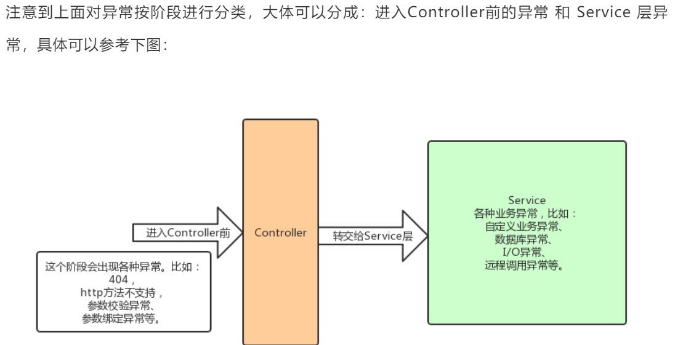

# `Springboot `优雅处理返回和异常处理

### 一、开发中常用的空返回
```java
1. 空集合
 判断：CollectionUtils.isEmpty(userList)
 
Lists.newArrayList();
Collections.EMPTY_LIST;

2. String 
commons.lang3
StringUtils.EMPTY;

```

### 二、优雅返回参考文档
`Springboot` 优雅处理返回和异常处理:

[springboot之全局异常拦截器](https://blog.csdn.net/qq_36922927/article/details/82026683)

[Springboot项目统一异常处理-404](https://blog.csdn.net/u014229347/article/details/93183143)

[如何设计API接口，实现统一格式返回？](https://www.toutiao.com/i6694404645827117572/)

[如何设计API接口，实现统一格式返回](https://www.jianshu.com/p/2b875befb1d8)

★★★

[分布式之API接口返回格式如何优雅设计？](https://www.codercto.com/a/79710.html)

[Spring Boot实战系列(4)统一异常处理](https://www.imooc.com/article/260354)

[Spring Boot实战系列](https://www.imooc.com/u/2667395/articles?label_id=62)


**`ResponseBodyAdvice `和 `@ControllerAdvice`**
[如何设计API接口，实现统一格式返回？](https://www.toutiao.com/i6694404645827117572/)

[掌握@ControllerAdvice配合RequestBodyAdvice/ResponseBodyAdvice使用，让你的选择不仅仅只有拦截器【享学Spring MVC】](https://blog.csdn.net/f641385712/article/details/101396307)


### 三、项目开发中对于`空`的处理
[Java中如何更优雅的处理空值](https://www.cnblogs.com/niudaben/p/11897961.html)
对于项目中如何处理常量
[可别在代码中写那么多魔法值了，脑壳疼！](https://www.jianshu.com/p/230c814ffe7d)


### 四、代码优雅实现的开源项目

`汇聚工具类、插件项目`

项目中有 代码的优雅实现，源头是干掉`try catch` 有策略模式、支付、接口幂等实现 等

[together](https://github.com/mark988/together)


源头是干掉`try catch` 

[project_frame_demo](https://github.com/ChenXiaoNuo/project_frame_demo)


### 五、成体系的优雅的后端接口

★★★  **`牛逼`**
项目实践 `SpringBoot`三招组合拳
从思路到实现，可以说是很全的一套服务端开发规范模板

[项目实践 SpringBoot三招组合拳，手把手教你打出优雅的后端接口](https://www.jianshu.com/p/b5b8613769db)

[项目实践 后端接口统一规范的同时，如何优雅得扩展规范](https://www.jianshu.com/p/ecc41e873fe3)

[GitHub 仓库地址](https://github.com/RudeCrab/rude-java)


### 六、干掉 try catch 
#### 1. 异常分类


```markdown
异常实际上只有两大类：
1. ServletException
2. ServiceException

进入`controller`前的异常
ServletException 异常分为：
1. hanldeServletException 
2. handleBindException
3. handleValidException

ServiceException 异常又分为：
1. 自定义异常 handleBusinessException handleBaseException
2. 未知异常   handleException

```

#### 2. 特殊的404
> 实际上当出现404的时候，默认是不抛异常的，而是 forward跳转到/error控制器，spring也提供了默认的error控制器
```properties
> 如何让404异常被捕获到,而不是走框架自带的异常处理逻辑。只需在properties文件中加入如下配置即可:
  spring.mvc.throw-exception-if-no-handler-found=true
  spring.resources.add-mappings=false

> 异常处理器中捕获它了，然后前端只要捕获到特定的状态码，立即跳转到404页面即可
```

#### 3. 参考文档
[干掉 try catch](https://mp.weixin.qq.com/s/zdwHINfGng5ffv8L46iETw)

[干掉 try catch ！](https://blog.csdn.net/xcbeyond/article/details/105872632)

[Java生鲜电商平台-统一异常处理及架构实战](https://www.cnblogs.com/jurendage/p/11255197.html)

[Java生鲜电商平台-缓存架构实战](https://www.cnblogs.com/jurendage/p/11269241.html)

★★★ 好像是原作者 

[统一异常处理介绍及实战](https://www.jianshu.com/p/3f3d9e8d1efa)

[GitHub仓库](https://github.com/sprainkle/spring-cloud-advance)
